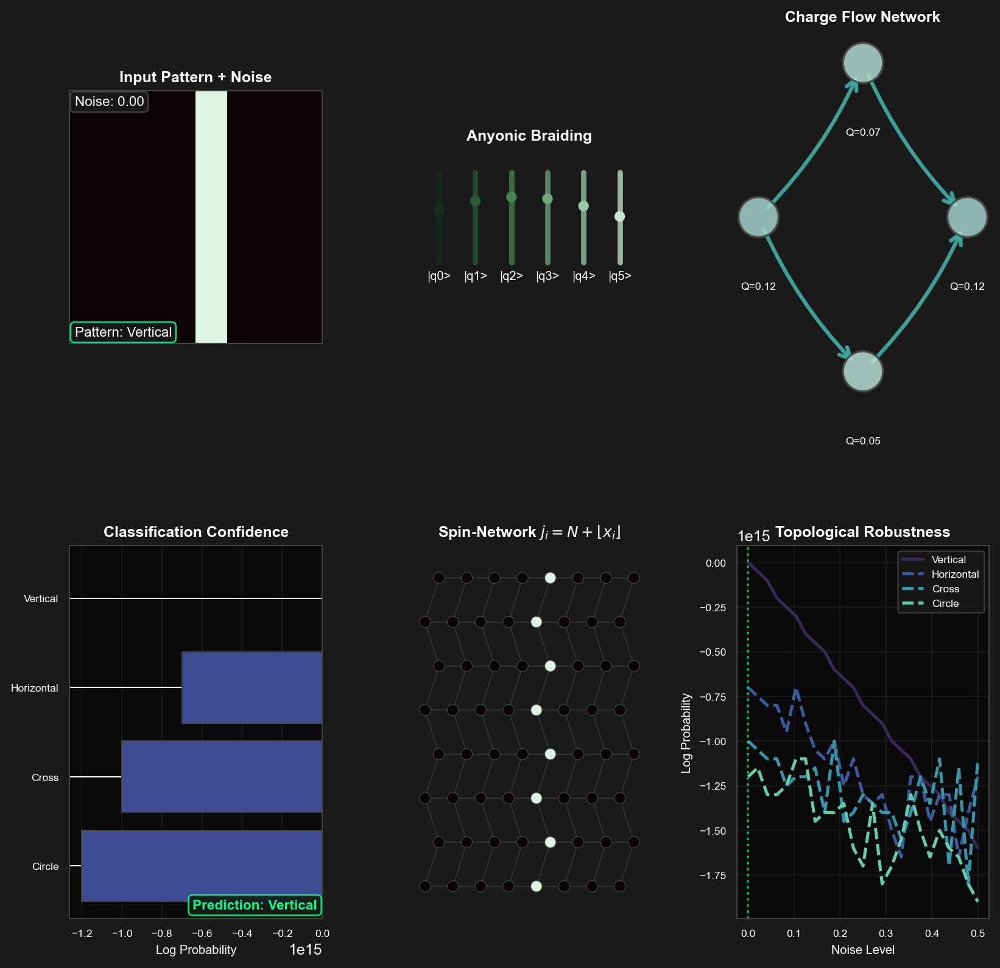
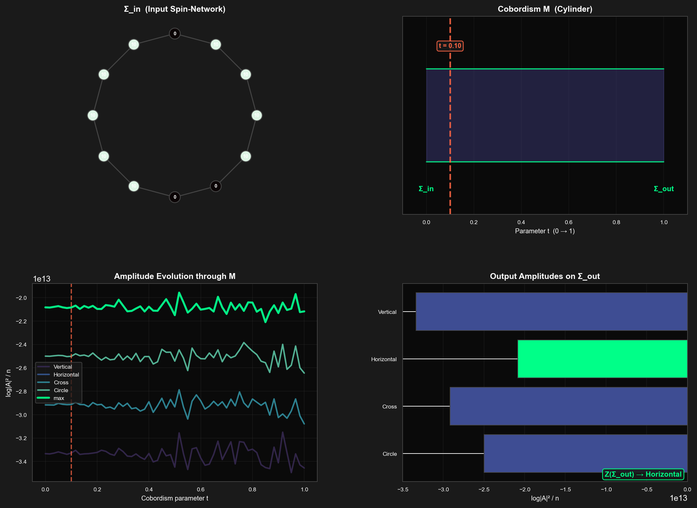
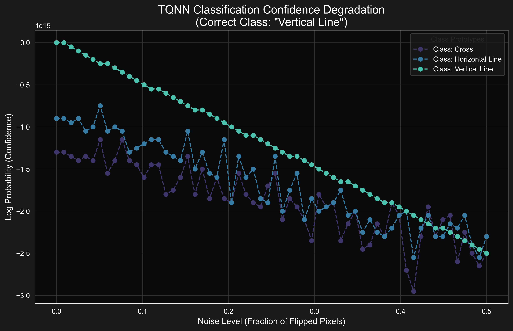
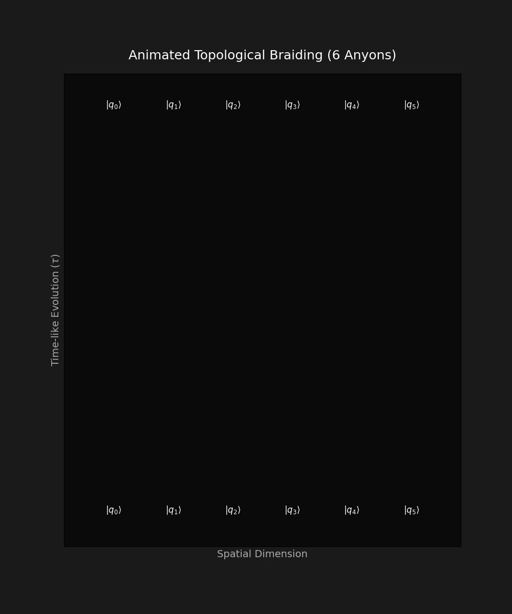
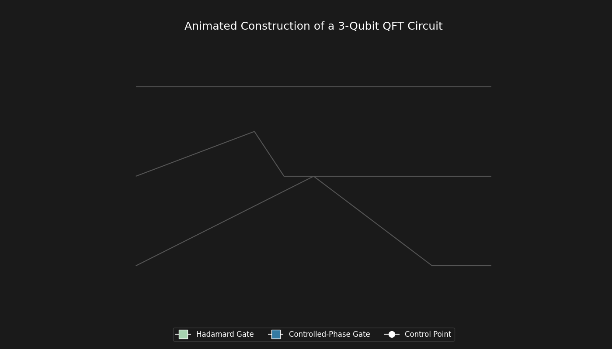
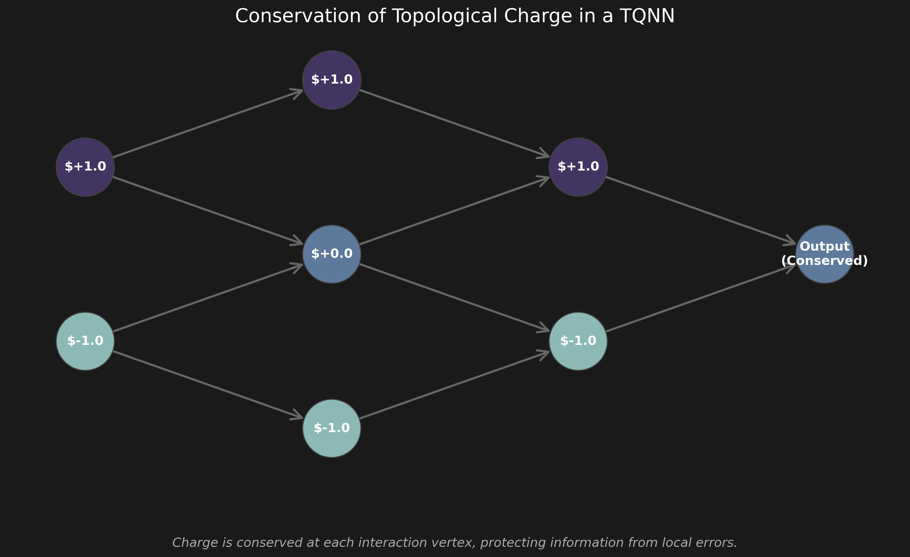
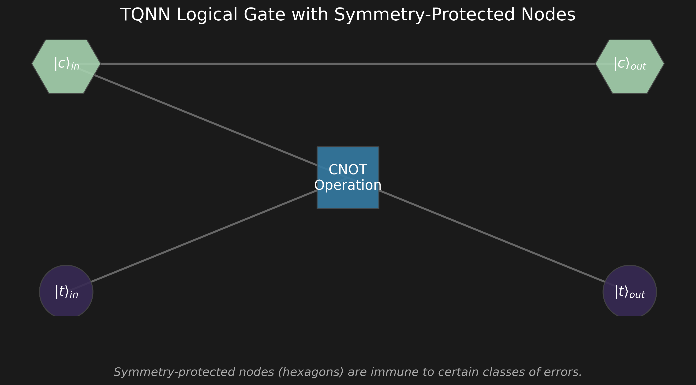

# Topological Quantum Neural Networks

Interactive tools for topological quantum neural networks: real-time tensor network simulation, topological pattern classification, cobordism evolution, and robustness analysis.


## Overview

Conventional neural networks learn by adjusting millions of floating-point weights through gradient descent. **Topological Quantum Neural Networks (TQNNs)** take a fundamentally different approach: they encode each input pixel as the *spin color* of an edge on a spin-network, then evaluate a topological quantum field theory (TQFT) transition amplitude to classify patterns — no gradient computation required.

Because the classification signal lives in a topological invariant, TQNNs are inherently resilient to local noise: flipping a few pixels shifts individual spins, but the global amplitude barely changes — an effect called **topological protection**. This repository provides interactive simulators and visualization tools that let you explore these ideas hands-on.

## Quick Start

```bash
git clone https://github.com/IsolatedSingularity/Topological-Quantum-Neural-Networks.git
cd Topological-Quantum-Neural-Networks
pip install -r requirements.txt
```

Run any of the interactive applications:

```bash
# Real-time tensor network simulator (tkinter GUI)
python "Code/Real Time Simulation/interactive_tqnn_tensor_network.py"

# Interactive TQNN classifier (tkinter GUI, 6-panel)
python "Code/Image Classification/interactive_tqnn_classifier.py"

# Cobordism evolution viewer (tkinter GUI)
python "Code/Cobordism Viewer/cobordism_evolution_viewer.py"

# Robustness sandbox (generates plots)
python "Code/Static Visualization/tqnn_sandbox.py"

# Static & animated visualizations (generates PNGs and GIFs)
python "Code/Static Visualization/static_visualizations.py"
python "Code/Static Visualization/animated_visualizations.py"

# Regenerate all plots + GUI screenshots at once
python generate_all_plots.py
```

<p align="center">
  
</p>

## Features

### Real-Time Tensor Network Simulator

Draw a pattern on a 16 × 16 canvas and watch it get encoded, in real time, as a hexagonal spin-network. Four synchronized panels update on every brush stroke:

| Panel | What it shows |
|---|---|
| **Spin-network** | Each pixel maps to a node on a hexagonal lattice; edge colors reflect the spin label $j_i = N + \lfloor x_i \rfloor$ |
| **Transition amplitudes** | Per-class log-probability bars computed from the TQFT amplitude formula |
| **6j-symbol heatmap** | Recoupling coefficients that govern how three incoming spins fuse at a vertex |
| **Semi-classical weights** | Distribution of the Gaussian suppression term across all spins |

The $N_{\text{large}}$ slider (100 – 5 000) controls the semi-classical regime: higher values sharpen the amplitude peaks, showing how the TQFT limit converges to classical classification.


|  |  |
|:--:|:--:|
|  |  |
| Drawing canvas with hexagonal lattice mapping | Multi-page tutorial with color-coded sections |

```python
# From Code/Real Time Simulation/interactive_tqnn_tensor_network.py
class TQNNProcessor:
    def compute_transition_amplitude(self, input_spins, proto_mean, proto_std):
        """
        TQFT transition amplitude in the large-j limit:
        A = prod_i Delta_{j_i} * exp(-(j_i - j_bar_i)^2 / (2 sigma_i^2))
        where Delta_j = 2j + 1 is the quantum dimension.
        """
```

---

### Interactive TQNN Classifier

A tkinter dark-themed GUI with six live panels that let you explore how topological protection keeps classification accurate under noise. Select one of four geometric patterns (vertical, horizontal, cross, circle), drag the noise slider to inject topological defects, and watch how the TQNN's confidence degrades — slowly, because the amplitude is a *global* topological invariant rather than a fragile local feature.

| Panel | Purpose |
|---|---|
| **Input + Noise** | Shows the pattern after random pixel flips (simulating local defects) |
| **Anyonic Braiding** | Animated world-lines of six quasi-particles, illustrating the braiding operations that underpin TQNN computation |
| **Charge Flow** | Directed graph showing how topological charge propagates from the input layer through hidden nodes to the output |
| **Classification** | Horizontal bar chart of per-class log-probabilities with the winning class highlighted |
| **Spin-Network** | Hexagonal lattice where each node color encodes spin magnitude $j_i$ |
| **Robustness** | Sweep of noise levels (0 – 50 %) showing all class curves; the current noise level is marked |

```python
# From Code/Image Classification/interactive_tqnn_classifier.py
class TQNNClassifierGUI:
    """Tkinter dark-themed GUI with six embedded matplotlib panels."""
    # --screenshot flag: save a headless capture and exit
    #   python interactive_tqnn_classifier.py --screenshot Plots/Classifier_Demo.png
```



---

### Cobordism Evolution Viewer

A cobordism is a manifold $M$ whose boundary splits into an *input* surface $\Sigma_{\text{in}}$ and an *output* surface $\Sigma_{\text{out}}$. The TQFT functor $Z$ maps $M$ to a linear map $Z(\Sigma_{\text{in}}) \to Z(\Sigma_{\text{out}})$: this is the "forward pass" of a TQNN.

This viewer animates the evolution of spin-network amplitudes as a cursor sweeps from $\Sigma_{\text{in}}$ to $\Sigma_{\text{out}}$ through three cobordism types:

| Cobordism | Topology | Effect on spins |
|---|---|---|
| **Cylinder** | Identity ($\Sigma \times [0,1]$) | Spins pass through with small thermal jitter |
| **Pair-of-Pants** | Splitting (genus 0, 3 boundaries) | Spins on the second half become pairwise averages — information shared between output legs |
| **Genus Handle** | Non-trivial genus | Cyclic coupling mixes distant spins, simulating a loop in the manifold |

```python
# From Code/Cobordism Viewer/cobordism_evolution_viewer.py
class CobordismProcessor:
    """Compute TQFT amplitudes along a cobordism M : Σ_in → Σ_out."""
    # --screenshot flag: python cobordism_evolution_viewer.py --screenshot Plots/Cobordism_Demo.png
```



---

### Robustness Sandbox

How much noise can a TQNN tolerate before it misclassifies? The sandbox answers this quantitatively: it trains a `TQNNPerceptron` on four geometric patterns, then sweeps noise from 0 % to 50 % while recording per-class log-probabilities. The resulting curve shows a gradual, graceful degradation — the hallmark of topological protection — rather than the abrupt cliff typical of local-feature classifiers.

```python
# From Code/Static Visualization/tqnn_sandbox.py
def plot_degradation(results, target_label, plot_path):
    """Noise-vs-confidence curves for every class."""
```



---

### Static and Animated Visualizations

Pre-generated braiding animations, charge flow diagrams, logical gate structures, and circuit compositions.

|  |  |
|:--:|:--:|
|  |  |
| Anyonic braiding (6 strands) | Toffoli gate circuit composition |
|  |  |
| Charge flow through spin-network | Logical gate structure |

---

## Project Structure

```
Code/
  Real Time Simulation/          # Tkinter tensor network simulator (1600+ lines)
  Image Classification/          # Tkinter 6-panel TQNN classifier
  Cobordism Viewer/              # Tkinter cobordism evolution viewer
  Static Visualization/          # Sandbox, static plots, animated GIFs, helpers
Plots/                           # Generated figures, animations, and GUI screenshots
References/                      # Source papers (Marciano, Lulli, Fields)
tests/                           # pytest suite (import + core logic)
generate_all_plots.py            # Regenerate all visuals + GUI screenshots
```

## Tech Stack

| Category | Tools |
|---|---|
| Language | Python 3.10+ |
| GUI | tkinter (dark theme), matplotlib embedded via `FigureCanvasTkAgg` |
| Computation | numpy, scipy (linear algebra, optimization) |
| Visualization | matplotlib, seaborn (`mako` / `cubehelix` palettes) |
| Graph Theory | networkx |
| Testing | pytest, GitHub Actions CI (3.10 / 3.11 / 3.12) |

---

<details>
<summary><h2>Theoretical Background</h2></summary>

### Overview

The core thesis, inspired by the research of Marciano, Fields, Lulli, and others, is that conventional DNNs can be understood as the semi-classical limit of a more general TQNN framework. TQNNs leverage the properties of topological invariants, making them naturally resilient to local perturbations and noise (topological protection).

### Spin-Network Encoding

A TQNN processes information encoded in **spin-networks**: graphs whose edges are labeled by irreducible representations of a quantum group (e.g., $SU(2)_k$), called "colors" ($j$), and whose nodes represent intertwiners. Input data is encoded as:

$$j_i = N + \lfloor x_i \rfloor$$

where $N$ is a large integer placing the system in the semi-classical regime.

### TQFT Transition Amplitudes

The core operation is the evaluation of a TQFT functor $Z$, mapping a cobordism $M$ (the evolution of spin-networks) to a transition amplitude:

$$Z(M): Z(\Sigma_{\text{in}}) \to Z(\Sigma_{\text{out}})$$

For a class $c$ with prototype mean $\bar{j}$ and standard deviation $\sigma$:

$$A_c \propto \prod_{i} \Delta_{j_i} e^{-\frac{(j_i - j_{c,i})^2}{2\sigma_{c,i}^2}}$$

where $\Delta_{j_i} = 2j_i + 1$ is the quantum dimension. Classification uses:

$$\text{prediction} = \arg\max_{c} \left( \log|A_c|^2 \right)$$

### MPS Decomposition

The quantum state from drawn patterns is decomposed into Matrix Product State (MPS) form:

$$|\psi\rangle = \sum_{i_1,\ldots,i_n} A^{[1]}_{i_1} A^{[2]}_{i_2} \cdots A^{[n]}_{i_n} |i_1 i_2 \cdots i_n\rangle$$

with entanglement entropy $S = -\sum_i \lambda_i^2 \log_2(\lambda_i^2)$ computed from Schmidt values.

### Braiding and Fusion

Anyonic braiding operations satisfy the Yang-Baxter equation:

$$(B \otimes I)(I \otimes B)(B \otimes I) = (I \otimes B)(B \otimes I)(I \otimes B)$$

Fusion of two spins follows $SU(2)$ rules:

$$j_1 \otimes j_2 = \bigoplus_{j_3=|j_1-j_2|}^{j_1+j_2} j_3$$

</details>

---

## Next Steps

- [ ] **Qiskit / PennyLane backend**: Integrate quantum circuit backends for hardware-ready execution
- [x] **Unit test coverage**: pytest suite for TQNN processor and spin-network encoding (`tests/`)
- [ ] **GPU acceleration**: Profile and optimize spin-network evaluation with CuPy or JAX
- [ ] **PyPI packaging**: Package the core TQNN library for `pip install` distribution
- [x] **CI/CD pipeline**: GitHub Actions workflow across Python 3.10/3.11/3.12 (`.github/workflows/ci.yml`)
- [x] **Export functionality**: `--screenshot` flag on all tkinter GUIs for reproducible images (`generate_all_plots.py`)

> [!NOTE]
> This implementation simulates topological quantum behavior on classical hardware. While it demonstrates the principles of topological robustness, it does not provide the computational advantages of a true quantum computer.

## Contributing

Contributions are welcome. To get started:

1. Fork the repository and create a feature branch
2. Install dependencies: `pip install -r requirements.txt`
3. Run the test suite: `pytest tests/`
4. Submit a pull request with a clear description of changes

Please follow the existing code style: use `seaborn` mako/cubehelix palettes for visualizations, include docstrings for public functions, and add type hints to function signatures.

## References

- Marciano, A., et al. *DNNs as the Semi-Classical Limit of TQNNs*.
- Lulli, M., et al. *Exact hexagonal spin-networks and TQNNs*.
- Fields, C., et al. *Sequential measurements, TQFTs, and TQNNs*.
